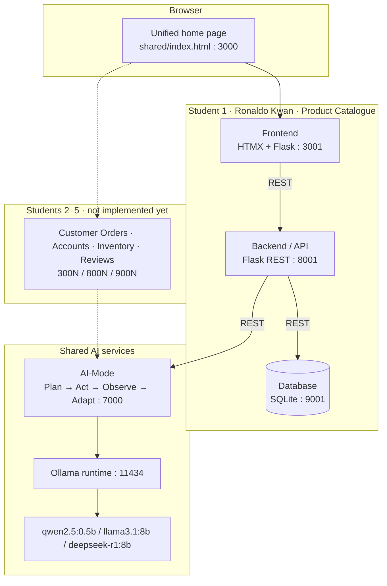
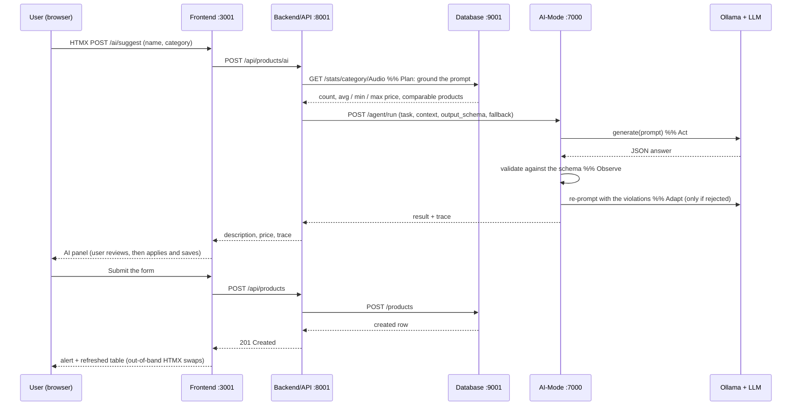
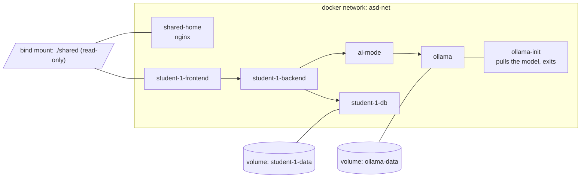
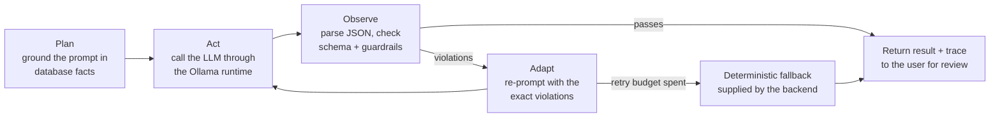
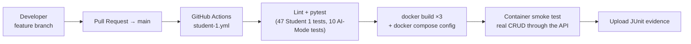

# Architecture

Diagrams are written in Mermaid so they render on GitHub. Export them to PNG into
`docs/diagrams/` before pasting them into the technical report.

## 1. Integrated architecture

Every box is its own container; the whole diagram is one `docker-compose.yml`.

## 2. Student 1 microservice detail

## 3. Docker Compose architecture

Host ports: 3000 home · 3001/8001/9001 Student 1 · 7000 AI-Mode · 11434 Ollama.

## 4. Plan → Act → Observe → Adapt

Implemented in `ai-services/ai-mode/agent/loop.py`; the caller's half (grounding, guardrails and
fallback) is in `student-1/backend/app/ai_agent.py`.

## 5. DevOps pipeline

